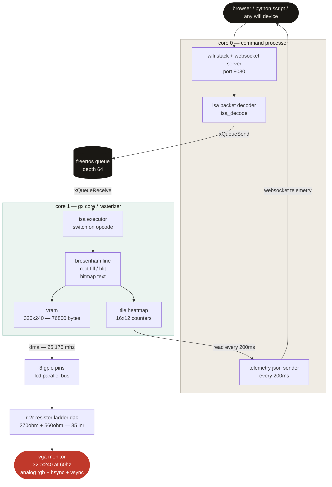

# GXU 1

A custom GPU co processor built on an ESP32 S3 microcontroller, a handful of resistors, and about two days of work. It drives a real VGA monitor, executes a custom binary instruction set over WiFi, and streams live telemetry back to a React dashboard. Total component cost: under 700 rupees.

## what it actually is

GXU 1 stands for Graphics Execution Unit, Revision 1. The idea was simple: can you build something that genuinely deserves to be called a GPU without using any dedicated display hardware? No display controller IC, no FPGA, no HDMI driver chip. Just a microcontroller, some resistors, and some decisions.

The answer turned out to be yes. GXU 1 accepts drawing commands over WebSocket, decodes them against a defined binary ISA, rasterizes them into a framebuffer using actual algorithms like Bresenham, and streams the result to a VGA monitor at 320x240 at 60Hz using a handbuilt R-2R resistor ladder DAC. The whole thing runs on two FreeRTOS cores with a hard architectural split: Core 0 handles all network traffic, Core 1 handles all rendering. They communicate through a FreeRTOS queue. DMA handles the display output independently of both.

## the ISA

GXU-1 has 8 opcodes. Every command is a binary packet with a one-byte opcode followed by arguments encoded as 16-bit big-endian integers.

| opcode | mnemonic | what it does |
|--------|----------|--------------|
| 0x01 | GXU_CLEAR | fill entire VRAM with a color |
| 0x02 | GXU_PIXEL | set one pixel |
| 0x03 | GXU_LINE | Bresenham line between two points |
| 0x04 | GXU_RECT_FILL | filled rectangle |
| 0x05 | GXU_RECT_OUTLINE | hollow rectangle |
| 0x06 | GXU_BLIT | copy a VRAM region to another location |
| 0x07 | GXU_TEXT | render ASCII string using 5x7 bitmap font |
| 0xFF | GXU_SWAP | flip double buffer, tear-free |

Color is encoded as a single byte: `[B1 B0 G1 G0 R1 R0 xx xx]`. Two bits per channel, 64 total colors.

A JSON equivalent of a single line command would be around 58 bytes and take several hundred microseconds to parse. The binary packet is 10 bytes and parses in under 5 microseconds.

## hardware

The VGA color signal is analog, ranging from 0V to 0.7V per channel. The ESP32-S3 only outputs digital 0V or 3.3V. Bridging that gap is the R-2R resistor ladder: a chain of 270 ohm and 560 ohm resistors that converts 2 digital bits per channel into the correct analog voltage. The whole DAC costs about 35 rupees in components.

The ESP32-S3 was chosen specifically because it has a hardware LCD parallel interface. This lets the DMA controller drive all 8 GPIO pins simultaneously in sync with VGA timing, at 25 MHz, without any CPU involvement. The original ESP32 does not have this peripheral.

## system architecture



## dashboard

The React/Vite dashboard runs in a browser on any device connected to the same WiFi. It sends binary ISA packets over a persistent WebSocket connection and receives telemetry JSON from the ESP32 every 200ms. The VRAM heatmap divides the 320x240 screen into 192 tiles (16 columns by 12 rows) and shows which regions are being written most heavily, using the same tile access frequency visualization pattern as AMD's Radeon GPU Profiler.

## BOM

| component | cost |
|-----------|------|
| ESP32-S3-DevKitC-1-N8 | 450-500 INR |
| 270 ohm resistors (18x) | 20 INR |
| 560 ohm resistors (9x) | 10 INR |
| 100 ohm resistors (2x) | 5 INR |
| VGA DB-15 connector | 30-50 INR |
| breadboard + jumper wires | 100 INR |
| **total** | **under 700 INR** |

## software emulator

If you do not have the hardware, there is a full browser based emulator that implements the complete ISA in JavaScript using the Canvas API and if you also want full blown explaination then do checkout the blog below:

Blog post & Emulator [check this out](https://princess0407.github.io/GXU-1/)

## running the firmware

```bash
# clone the repo
git clone https://github.com/Princess0407/GXU-1.git

# open in Arduino IDE or PlatformIO
# set your WiFi credentials in config.h
# flash to ESP32 S3-DevKitC 1 N8
# open serial monitor to get the IP address
# navigate to that IP in a browser
```

Dependencies: ESPAsyncWebServer, ArduinoJson, FreeRTOS (included with ESP IDF).

